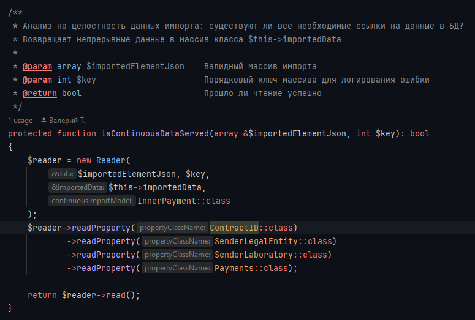

## Сервис импорта JSON в БД Laravel
Набор абстракций для упрощения анализа целостности переданных данных и чтения элементов с учётом проверок на 
интегрированность значений.  

### Удобный фасад для последовательного анализа JSON

### Правила чтения для каждого поля с уникальным текстом ошибки чтения и возможностью пропустить чтение только одного ошибочного элемента. 

### Модель для сохранения импортированных данных в формат, удобный для записи в БД.
